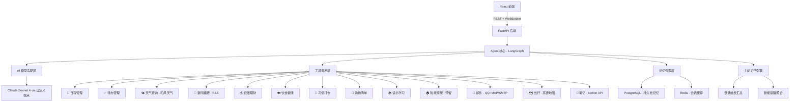
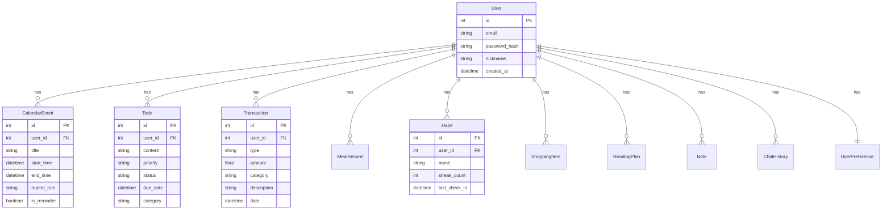

# 系统架构设计

## 1. 架构概览



## 2. 模块划分

### 2.1 用户界面层（React 前端）
- **职责**：用户交互界面、对话展示、数据可视化面板
- **技术**：React 18 + TailwindCSS + Zustand（状态管理）
- **核心页面**：
  - 对话主页（聊天界面 + 快捷功能入口）
  - 数据面板（记账图表、打卡日历、日程视图）
  - 设置页（个人信息、API 配置、偏好设置）
  - 登录/注册页

### 2.2 API 层（FastAPI）
- **职责**：请求路由、参数校验、JWT 身份验证、WebSocket 管理
- **技术**：FastAPI + Pydantic + python-jose (JWT)
- **核心路由**：
  - `POST /api/auth/register` — 注册
  - `POST /api/auth/login` — 登录
  - `WS /api/chat` — 对话（WebSocket 流式响应）
  - `GET /api/dashboard/summary` — 登录汇总
  - `GET /api/dashboard/finance` — 财务统计
  - `GET /api/dashboard/habits` — 打卡统计

### 2.3 Agent 核心层（LangGraph）
- **模式**：ReAct（Reasoning + Acting）
- **决策流程**：
  ```
  用户消息 → 意图识别
    → 需要工具？
      → 是 → 选择工具 → 执行工具 → 获取结果 → 组织回复
      → 否 → 直接对话回复
    → 需要多步操作？
      → 是 → Plan-and-Execute（分步执行）
      → 否 → 单步完成
    → 生成自然语言回复 → 返回给用户
  ```
- **多工具路由**：基于用户意图自动路由到 15 个工具中的一个或多个

### 2.4 AI 模型适配层
- **设计**：通用适配器模式（Adapter Pattern）
- **当前模型**：Claude Sonnet 4（via 自定义端点）
- **切换方式**：修改环境变量即可，无需改代码
- **支持协议**：兼容 OpenAI Chat Completions API 格式

### 2.5 工具调用层

| 工具 | 数据源 | 说明 |
|------|--------|------|
| 日程管理 | PostgreSQL | 内建 CRUD |
| 待办管理 | PostgreSQL | 内建 CRUD + 优先级 |
| 天气查询 | 和风天气 API | 实时 + 7 日预报 |
| 新闻摘要 | RSS + NewsAPI | 多源聚合 + AI 摘要 |
| 记账理财 | PostgreSQL | 收支 CRUD + 统计 |
| 饮食健康 | PostgreSQL | 饮食记录 + 营养估算 |
| 习惯打卡 | PostgreSQL | 打卡 + 连续统计 |
| 购物清单 | PostgreSQL | 清单 CRUD |
| 读书学习 | PostgreSQL | 计划 + 进度 |
| 智能家居 | Mock/预留 | 通用适配器接口 |
| 邮件管理 | QQ 邮箱 IMAP/SMTP | 收发邮件 |
| 出行规划 | 高德地图 API | 路线 + POI |
| 备忘笔记 | PostgreSQL + Notion API | 本地存储 + 云同步 |

### 2.6 记忆管理层
- **短期记忆**：Redis 缓存最近 20 轮对话（按会话隔离）
- **长期记忆**：PostgreSQL 存储所有历史对话（可检索）
- **用户偏好**：PostgreSQL 存储用户设置（默认城市、常用地址等）

### 2.7 主动关怀引擎
- **触发时机**：用户登录 / 打开应用
- **汇总逻辑**：
  ```
  登录时 → 并行查询：
    ├── 今日天气 + 穿衣建议
    ├── 今日日程
    ├── 过期/即将到期待办
    ├── 未打卡习惯
    ├── 预算超支预警
    ├── 未读邮件摘要
    ├── 读书进度提醒
    └── 纪念日/特殊日期
  → AI 组织成温暖的"今日管家报告"
  → 推送给用户
  ```

## 3. 数据流

```
用户输入（文字）
  → React 前端 (WebSocket)
  → FastAPI 接收 + JWT 验证
  → LangGraph Agent 核心
    → 意图识别（由 AI 模型完成）
    → 路由到对应工具
    → 工具执行（读写数据库/调用外部 API）
    → 工具返回结果
    → AI 组织自然语言回复
  → WebSocket 流式返回给前端
  → React 渲染对话气泡
```

## 4. 数据库设计概览



## 5. 目录结构

```
LifeButler/
├── backend/
│   ├── app/
│   │   ├── __init__.py
│   │   ├── main.py              # FastAPI 入口 + CORS + 中间件
│   │   ├── agent/
│   │   │   ├── __init__.py
│   │   │   ├── core.py          # LangGraph Agent 主编排
│   │   │   ├── memory.py        # 对话记忆管理
│   │   │   ├── proactive.py     # 主动关怀引擎
│   │   │   └── prompts.py       # System Prompt 定义
│   │   ├── tools/
│   │   │   ├── __init__.py
│   │   │   ├── base.py          # 工具基类
│   │   │   ├── calendar.py      # 日程管理工具
│   │   │   ├── todo.py          # 待办管理工具
│   │   │   ├── weather.py       # 天气查询工具
│   │   │   ├── news.py          # 新闻摘要工具
│   │   │   ├── finance.py       # 记账理财工具
│   │   │   ├── health.py        # 饮食健康工具
│   │   │   ├── habit.py         # 习惯打卡工具
│   │   │   ├── shopping.py      # 购物清单工具
│   │   │   ├── reading.py       # 读书学习工具
│   │   │   ├── smarthome.py     # 智能家居工具（预留）
│   │   │   ├── email_tool.py    # 邮件管理工具
│   │   │   ├── travel.py        # 出行规划工具
│   │   │   └── notion.py        # Notion 同步工具
│   │   ├── api/
│   │   │   ├── __init__.py
│   │   │   ├── auth.py          # 认证路由
│   │   │   ├── chat.py          # 对话 WebSocket
│   │   │   ├── dashboard.py     # 面板数据接口
│   │   │   └── deps.py          # 依赖注入
│   │   ├── models/
│   │   │   ├── __init__.py
│   │   │   ├── user.py          # 用户模型
│   │   │   ├── calendar.py      # 日程模型
│   │   │   ├── todo.py          # 待办模型
│   │   │   ├── finance.py       # 财务模型
│   │   │   ├── health.py        # 健康模型
│   │   │   ├── habit.py         # 习惯模型
│   │   │   ├── shopping.py      # 购物模型
│   │   │   ├── reading.py       # 读书模型
│   │   │   ├── note.py          # 笔记模型
│   │   │   └── chat.py          # 聊天记录模型
│   │   ├── schemas/
│   │   │   ├── __init__.py
│   │   │   └── ...              # Pydantic 请求/响应模型
│   │   ├── services/
│   │   │   ├── __init__.py
│   │   │   ├── auth.py          # 认证服务
│   │   │   ├── ai_provider.py   # AI 模型适配器
│   │   │   └── encryption.py    # 数据加密服务
│   │   ├── config/
│   │   │   ├── __init__.py
│   │   │   ├── settings.py      # 全局配置（从 .env 读取）
│   │   │   └── database.py      # 数据库连接配置
│   │   └── utils/
│   │       ├── __init__.py
│   │       └── helpers.py       # 通用工具函数
│   ├── tests/
│   │   ├── unit/
│   │   ├── integration/
│   │   └── e2e/
│   ├── alembic/                 # 数据库迁移
│   │   ├── env.py
│   │   └── versions/
│   ├── alembic.ini
│   ├── requirements.txt
│   └── Dockerfile
├── frontend/
│   ├── src/
│   │   ├── App.tsx
│   │   ├── main.tsx
│   │   ├── components/
│   │   │   ├── Chat/            # 对话相关组件
│   │   │   ├── Dashboard/       # 面板组件
│   │   │   ├── Auth/            # 登录注册组件
│   │   │   └── Common/          # 通用组件（按钮、卡片等）
│   │   ├── pages/
│   │   │   ├── ChatPage.tsx
│   │   │   ├── DashboardPage.tsx
│   │   │   ├── LoginPage.tsx
│   │   │   └── SettingsPage.tsx
│   │   ├── hooks/
│   │   │   ├── useWebSocket.ts
│   │   │   ├── useAuth.ts
│   │   │   └── useDashboard.ts
│   │   ├── stores/
│   │   │   ├── authStore.ts
│   │   │   ├── chatStore.ts
│   │   │   └── dashboardStore.ts
│   │   ├── services/
│   │   │   ├── api.ts           # Axios 实例
│   │   │   ├── authService.ts
│   │   │   └── chatService.ts
│   │   ├── styles/
│   │   │   └── globals.css
│   │   └── utils/
│   │       └── helpers.ts
│   ├── public/
│   ├── index.html
│   ├── package.json
│   ├── tsconfig.json
│   ├── tailwind.config.js
│   ├── vite.config.ts
│   └── Dockerfile
├── docker-compose.yml
├── .env.example
├── .gitignore
├── TODO.md
├── DEV_LOG.md
└── FAILURES.md
```

## 6. 开发架构：外部记忆 + 双阶段

### 核心原则：硬盘换内存
- 每轮开发上下文可清零
- 文件系统(Git)保留完整状态
- 通过读取文件恢复上下文

### 外部记忆文件
- `TODO.md` — 任务状态跟踪
- `DEV_LOG.md` — 开发日志记录
- `FAILURES.md` — 失败记录
- `.git/` — 版本控制与回滚

### Phase 1: 初始化（一次性）
1. 创建完整目录结构（backend + frontend）
2. 初始化 Python 虚拟环境 + 安装后端依赖
3. 初始化 npm + 安装前端依赖
4. 配置 .env.example、.gitignore
5. 初始化 PostgreSQL 数据库 + Alembic 迁移
6. 初始化 Git 仓库
7. 创建 TODO.md / DEV_LOG.md / FAILURES.md
8. 创建测试配置（pytest.ini + jest.config）
9. 不写任何业务代码

### Phase 2: 增量开发（循环）
每轮：读取状态 → 写测试 → 写代码 → 跑测试 → 提交 → 清上下文
